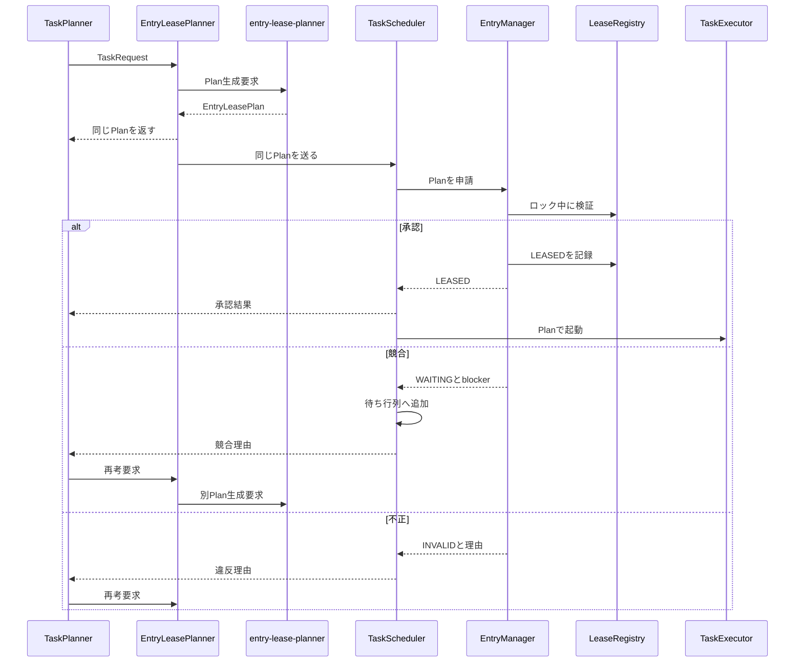
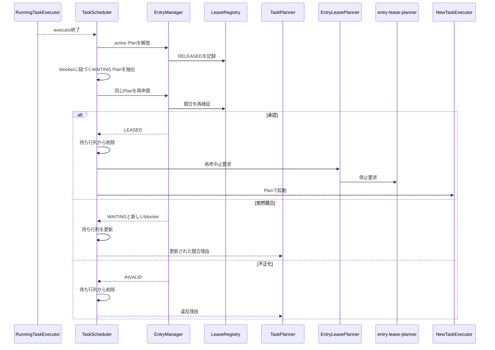
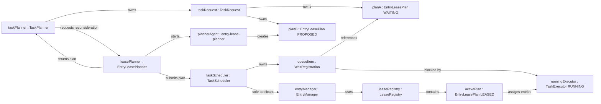
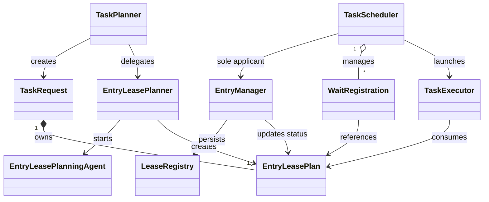

# Architecture

## 不変条件

1. `TaskScheduler`だけが`EntryManager.acquire()`を呼ぶ。
2. 待ち行列には、直近の判断が競合による`WAITING`のPlanだけが存在する。
3. `TaskExecutor`は`LEASED`のPlanでのみ起動し、リースを再申請しない。
4. 同じ`task_id`と`executor_id`には、それぞれ最大一つの有効リースしか存在しない。
5. blockerの終了は再申請の契機であり、起動許可そのものではない。
6. 待機Planと再考Planのうち、最初に`LEASED`となった一つだけを実行する。

## 初回申請

## blocker終了時の再申請

## オブジェクト図

## クラス図

